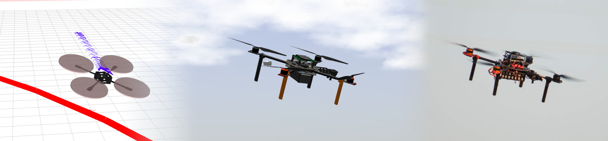

# ROS2 MRS UAV system




The [Multi-robot Systems Group](http://mrs.felk.cvut.cz) is a robotics lab at the [Czech Technical University in Prague](https://www.cvut.cz/).
We specialize in multi-rotor helicopters, and for them specifically, we develop this control, estimation, and simulation system.
We think real-world and replicable experiments should support excellent research and science in robotics.
Thus, our platform is built to allow safe real-world experimental validation of approaches in planning, control, estimation, computer vision, tracking, and more.

## ROS2

Do you want to monitor the state of transition to ROS2 in real time?
Check the following diagram:

[](https://ctu-mrs.github.io/ros2_obsidian_knowledgebase/main_canvas.html)

## System properties

The system is

* built on the [Robot Operating System](https://www.ros.org/) Jazzy,
* meant to be executed entirely onboard on a companion computer,
* can control underactuated multirotor helicopters,
* contains control, state estimation, mapping, and planning pipelines.


## [Documentation](https://ctu-mrs.github.io/)

The primary documentation source is here: [https://ctu-mrs.github.io/](https://ctu-mrs.github.io/).
However, the website only scratches the surface of what it should contain (and we know it).
Our system is a research-oriented platform, and it evolves rapidly.
Most of our users are either researchers (who already know the platform) or freshmen students (who might not know ROS).
Maintaining up-to-date documentation for such an audience is hard work since we mostly develop the system while using it for our research.
So, instead, we aim at educating our students to look around the packages (each contains its own README), explore the launch files, and be able to read the code, which we strive to keep readable.

[](https://github.com/ctu-mrs/mrs_uav_system/raw/diagram/mrs_uav_system_diagram.png)

The control and estimation system are described in the article [doi.org/10.1007/s10846-021-01383-5](https://doi.org/10.1007/s10846-021-01383-5), [pdf](https://link.springer.com/content/pdf/10.1007/s10846-021-01383-5.pdf):

```
Baca, T., Petrlik, M., Vrba, M., Spurny, V., Penicka, R., Hert, D., and Saska, M.,
"The MRS UAV System: Pushing the Frontiers of Reproducible Research, Real-world Deployment, and
Education with Autonomous Unmanned Aerial Vehicles", J Intell Robot Syst 102, 26 (2021).
```

## Installation

### Native installation

1. Install the Robot Operating System (Jazzy):

```bash
curl https://ctu-mrs.github.io/ppa2-stable/add_ros_ppa.sh | bash
sudo apt install ros-jazzy-desktop-full ros-dev-tools
```

2. Configure your ROS environment according to [https://docs.ros.org/en/jazzy/Installation/Ubuntu-Install-Debs.html#setup-environment](https://docs.ros.org/en/jazzy/Installation/Ubuntu-Install-Debs.html#setup-environment)

3. Add the **[stable](https://github.com/ctu-mrs/ppa2-stable)** PPA into your apt-get repository:

```bash
curl https://ctu-mrs.github.io/ppa2-stable/add_ppa.sh | bash
```

  * <details>
    <summary>>>> Special instructions for the MRS System developers <<<</summary>

      * Instead of the stable PPA, you can add the **[unstable](https://github.com/ctu-mrs/ppa2-unstable)** PPA, for which the packages are build immediatelly after being pushed to **ros2**.
      * If you have both PPAs, the **unstable** has a priority.
      * Beware! The **unstable** PPA might be internally inconsistent, buggy and dangerous!

      <br>

      * If you use the shell additions described [here](https://ctu-mrs.github.io/docs/prerequisites/ros2/workspace-build/#3-get-aliases-that-make-common-ros2-commands-usable), you should **not** manually source ROS or your workspaces.
      * You should normally use [zenoh](https://ctu-mrs.github.io/docs/installation/native-installation#4-set-zenoh-to-be-the-used-rmw-implementation) as the RMW implementation. 

    </details>

4. Install the MRS UAV System:

```bash
sudo apt install ros-jazzy-mrs-uav-system-full
```

5. Start the example MRS simulation session:

```bash
cd /opt/ros/jazzy/share/mrs_multirotor_simulator/tmux/mrs_one_drone
./start.sh
```

## System components

| Main metapackages     | Contents               | Repository                                                            | Package                          |
|-----------------------|------------------------|-----------------------------------------------------------------------|----------------------------------|
| MRS UAV System        | UAV Core & UAV Modules | [mrs_uav_system](https://github.com/ctu-mrs/mrs_uav_system/tree/ros2) | `ros-jazzy-mrs-uav-system`       |
| MRS UAV System - Full | All of the bellow      | [mrs_uav_system](https://github.com/ctu-mrs/mrs_uav_system/tree/ros2) | `ros-jazzy-mrs-uav-system-full` |

| Optional Modules & metapackages | Repository                                                                                               | Package                                  |
|---------------------------------|----------------------------------------------------------------------------------------------------------|------------------------------------------|
| UAV Core                        | [mrs_uav_core](https://github.com/ctu-mrs/mrs_uav_core/tree/ros2)                                        | `ros-jazzy-mrs-uav-core`                 |
| UAV Modules                     | [mrs_uav_modules](https://github.com/ctu-mrs/mrs_uav_modules/tree/ros2)                                  | `ros-jazzy-mrs-uav-modules`              |
| Octomap Mapping+Planning        | [mrs_octomap_mapping_planning](https://github.com/ctu-mrs/mrs_octomap_mapping_planning/tree/ros2)        | `ros-jazzy-mrs-octomap-mapping-planning` |
| OpenVINS Core                   | [mrs_open_vins_core](https://github.com/ctu-mrs/mrs_open_vins_core/tree/ros2)                            | `ros-jazzy-mrs-open-vins-core`           |
| PointLIO Core                   | [mrs_point_lio_core](https://github.com/ctu-mrs/mrs_point_lio_core/tree/ros2)                            | `ros-jazzy-mrs-point-lio-core`           |
| Precise Landing                 | TODO                                                                                                     | TODO                                     |
| ALOAM Core                      | TODO (?, probably not)                                                                                   | TODO                                     |
| LIO-SAM Core                    | TODO (?, probably not)                                                                                   | TODO                                     |
| Hector Core                     | TODO (?, probably not)                                                                                   | TODO                                     |

| Simulators               | Repository                                                                                          | Package                                   |
|--------------------------|-----------------------------------------------------------------------------------------------------|-------------------------------------------|
| MRS Multirotor Simulator | [mrs_multirotor_simulator](https://github.com/ctu-mrs/mrs_multirotor_simulator/tree/ros2)           | `ros-jazzy-mrs-multirotor-simulator`      |
| FlightForge Simulator    | [mrs_uav_flightforge_simulator](https://github.com/ctu-mrs/mrs_uav_flightforge_simulator/tree/ros2) | `ros-jazzy-mrs-uav-flightforge-simulator` |
| Gazebo Simulator         | [mrs_uav_gazebo_simulation](https://github.com/ctu-mrs/mrs_uav_gazebo_simulation/tree/ros2)         | `ros-jazzy-mrs-uav-gazebo-simulator`      |
| Coppelia Simulator       | TODO                                                                                                | TODO                                      |

| Hardware API plugins | Repository                                                                          | Package                           |
|----------------------|-------------------------------------------------------------------------------------|-----------------------------------|
| PX4 API              | [mrs_uav_px4_api](https://github.com/ctu-mrs/mrs_uav_px4_api/tree/ros2)             | `ros-jazzy-mrs-uav-px4-api`       |
| DJI Tello API        | [mrs_uav_dji_tello_api](https://github.com/ctu-mrs/mrs_uav_dji_tello_api/tree/ros2) | `ros-jazzy-mrs-uav-dji-tello-api` |

## Example packages

| Examples                    | Repository                                                                                        |
|-----------------------------|---------------------------------------------------------------------------------------------------|
| Core examples               | [mrs_core_examples](https://github.com/ctu-mrs/mrs_core_examples/tree/ros2)                       |
| Computer Vision examples    | [mrs_computer_vision_examples](https://github.com/ctu-mrs/mrs_computer_vision_examples/tree/ros2) |
| Gazebo Custom Drone example | TODO                                                                                              |

## Build status ([Buildfarm](https://github.com/ctu-mrs/buildfarm))

We utilize acceptance tests to determine the releasaiblity of the system and to release the system automatically.
The **stable** version of our system should be installable and working allways regardless of the state of the tests and _red flags_ below.

## Docker - stable/unstable rolling release

Download from Dockerhub: [ctumrs/mrs_uav_system](https://hub.docker.com/r/ctumrs/mrs_uav_system/tags)

The multiarch (AMD and ARM64) docker image contains the `ros-jazzy-mrs-uav-system-full` ROS package and, with that, all the MRS dependencies.

## ROS2 Build status (in development)([Buildfarm2](https://github.com/ctu-mrs/buildfarm2))

### PPAs

| [Stable](https://github.com/ctu-mrs/ppa2-stable)                                                                                                                           | Testing                                                                                                                                                                | [Unstable](https://github.com/ctu-mrs/ppa2-unstable)                                                                                                                               |
|----------------------------------------------------------------------------------------------------------------------------------------------------------------------------|------------------------------------------------------------------------------------------------------------------------------------------------------------------------|------------------------------------------------------------------------------------------------------------------------------------------------------------------------------------|
| [](https://github.com/ctu-mrs/ppa2-stable/actions/workflows/deploy.yml) | [](https://github.com/ctu-mrs/ppa2-testing/actions/workflows/deploy.yml)      | [](https://github.com/ctu-mrs/ppa2-unstable/actions/workflows/deploy.yml) |

## Docker pipelines

Any package within the system have the option to generate a docker image.
These are typically thirdparty package with complex dependencies that can not be easily satisfied through the `apt` installation system.
Additionally, the `mrs-uav-system` package generates a docker image with the full system.

|                         | [Stable](https://github.com/ctu-mrs/ppa-stable)                                                                                                                                                                        | Unstable                                                                                                                                                                                                                     |
|-------------------------|------------------------------------------------------------------------------------------------------------------------------------------------------------------------------------------------------------------------|------------------------------------------------------------------------------------------------------------------------------------------------------------------------------------------------------------------------------|
| MRS ROS Packages        | [](https://github.com/ctu-mrs/buildfarm2/actions/workflows/stable_mrs_dockers.yml)                      | [](https://github.com/ctu-mrs/buildfarm2/actions/workflows/unstable_mrs_dockers.yml)                      |
| Thirdparty ROS packages | [](https://github.com/ctu-mrs/buildfarm2/actions/workflows/stable_thirdparty_dockers.yml) | [](https://github.com/ctu-mrs/buildfarm2/actions/workflows/unstable_thirdparty_dockers.yml) |

### Testing

| Stable                                                                                                                                                                       | Release candidate                                                                                                                                                                                                         | Unstable                                                                                                                                                                           | Test coverage                                                                                                 |
|------------------------------------------------------------------------------------------------------------------------------------------------------------------------------|---------------------------------------------------------------------------------------------------------------------------------------------------------------------------------------------------------------------------|------------------------------------------------------------------------------------------------------------------------------------------------------------------------------------|---------------------------------------------------------------------------------------------------------------|
| [](https://github.com/ctu-mrs/buildfarm2/actions/workflows/test_stable.yml) | [](https://github.com/ctu-mrs/buildfarm2/actions/workflows/build_testing_test_release.yml) | [](https://github.com/ctu-mrs/buildfarm2/actions/workflows/test_unstable.yml) | [](https://ctu-mrs.github.io/buildfarm2) |

### x86-64/AMD64

|                         | [Stable](https://github.com/ctu-mrs/ppa2-stable)                                                                                                                                                                 | Release Candidate                                                                                                                                                                                                         | [Unstable](https://github.com/ctu-mrs/ppa2-unstable)                                                                                                                                                                   |
|-------------------------|------------------------------------------------------------------------------------------------------------------------------------------------------------------------------------------------------------------|---------------------------------------------------------------------------------------------------------------------------------------------------------------------------------------------------------------------------|------------------------------------------------------------------------------------------------------------------------------------------------------------------------------------------------------------------------|
| MRS ROS Packages        | [](https://github.com/ctu-mrs/buildfarm2/actions/workflows/stable_mrs_amd64.yml)                      | [](https://github.com/ctu-mrs/buildfarm2/actions/workflows/build_testing_test_release.yml) | [](https://github.com/ctu-mrs/buildfarm2/actions/workflows/unstable_mrs_amd64.yml)                      |
| Thirdparty ROS packages | [](https://github.com/ctu-mrs/buildfarm2/actions/workflows/stable_thirdparty_amd64.yml) | [](https://github.com/ctu-mrs/buildfarm2/actions/workflows/testing_thirdparty_amd64.yml)      | [](https://github.com/ctu-mrs/buildfarm2/actions/workflows/unstable_thirdparty_amd64.yml) |
| Non-ROS packages        | [](https://github.com/ctu-mrs/buildfarm2/actions/workflows/stable_nonbloom_amd64.yml)       | [](https://github.com/ctu-mrs/buildfarm2/actions/workflows/testing_nonbloom_amd64.yml)            | [](https://github.com/ctu-mrs/buildfarm2/actions/workflows/unstable_nonbloom_amd64.yml)       |

### AARCH64/ARM64

|                         | [Stable](https://github.com/ctu-mrs/ppa2-stable)                                                                                                                                                                | [Unstable](https://github.com/ctu-mrs/ppa2-unstable)                                                                                                                                                                  |
|-------------------------|-----------------------------------------------------------------------------------------------------------------------------------------------------------------------------------------------------------------|-----------------------------------------------------------------------------------------------------------------------------------------------------------------------------------------------------------------------|
| MRS ROS Packages        | [](https://github.com/ctu-mrs/buildfarm2/actions/workflows/stable_mrs_arm64.yml)                     | [](https://github.com/ctu-mrs/buildfarm2/actions/workflows/unstable_mrs_arm64.yml)                     |
| Thirdparty ROS packages | [](https://github.com/ctu-mrs/buildfarm2/actions/workflows/stable_thirdparty_arm64.yml) | [](https://github.com/ctu-mrs/buildfarm2/actions/workflows/unstable_thirdparty_arm64.yml) |
| Non-ROS packages        | [](https://github.com/ctu-mrs/buildfarm2/actions/workflows/stable_nonbloom_arm64.yml)       | [](https://github.com/ctu-mrs/buildfarm2/actions/workflows/unstable_nonbloom_arm64.yml)       |

# Disclaimer

THIS SOFTWARE IS PROVIDED BY THE COPYRIGHT HOLDERS AND CONTRIBUTORS "AS IS"
AND ANY EXPRESS OR IMPLIED WARRANTIES, INCLUDING, BUT NOT LIMITED TO, THE
IMPLIED WARRANTIES OF MERCHANTABILITY AND FITNESS FOR A PARTICULAR PURPOSE ARE
DISCLAIMED. IN NO EVENT SHALL THE COPYRIGHT HOLDER OR CONTRIBUTORS BE LIABLE
FOR ANY DIRECT, INDIRECT, INCIDENTAL, SPECIAL, EXEMPLARY, OR CONSEQUENTIAL
DAMAGES (INCLUDING, BUT NOT LIMITED TO, PROCUREMENT OF SUBSTITUTE GOODS OR
SERVICES; LOSS OF USE, DATA, OR PROFITS; OR BUSINESS INTERRUPTION) HOWEVER
CAUSED AND ON ANY THEORY OF LIABILITY, WHETHER IN CONTRACT, STRICT LIABILITY,
OR TORT (INCLUDING NEGLIGENCE OR OTHERWISE) ARISING IN ANY WAY OUT OF THE USE
OF THIS SOFTWARE, EVEN IF ADVISED OF THE POSSIBILITY OF SUCH DAMAGE.
